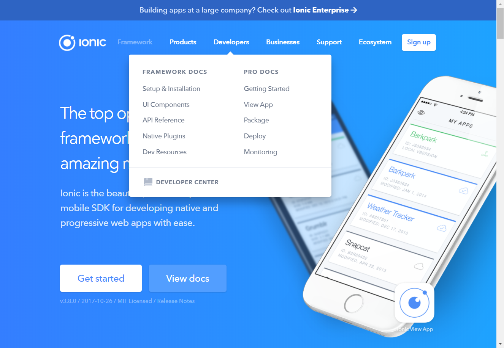

# Ionic hover menu

Create the ionic hover menu

## Milestone 1 - Time: 1 hour
create the popup menu
1. make sure to get it as pixel perfect as possible
1. use "css triangle" for the upper tip: https://css-tricks.com/examples/ShapesOfCSS/ 

## Milestone 2 - Time: 30 minutes
create the main menu including the logo and "signup" button

## Milestone 3 - Time: 30 minutes
make the ionic menu appear on hover. 
see: https://schier.co/blog/2014/10/23/creating-a-pure-css-dropdown-using-the-hover-selector.html 

## Milestone 4 - Time: 30 minutes
add animations and imitate as closely as you can the behavior of the ionic site

Screenshot:
